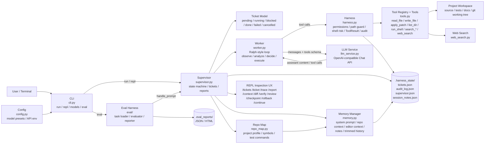

# DeepSeek Code CLI Architecture

DeepSeek Code CLI 的目标是做一个 Claude Code 风格的本地 AI 编码助手：它不是通用聊天 CLI，而是围绕仓库上下文、Ticket、受控工具、审计、验证和恢复能力构建的编码闭环。

当前实现采用单进程、单 Worker 架构。设计重点是先把一个任务可靠地跑通，再逐步演进到更强的沙箱、长期记忆、多 Worker 和 IDE 集成。

## 项目目标

- 项目感知：启动时扫描仓库，构建 Repo Map，向模型注入语言、关键文件、入口点、测试命令和 Python 符号摘要。
- 任务驱动：用户请求先进入 Supervisor，创建 Ticket，必要时拆分子 Ticket，并跟踪状态、日志和结果。
- 工具执行：Worker 通过 function calling 调用文件、搜索、补丁、Shell 和联网搜索工具。
- 安全可审计：所有工具调用经过 Harness，文件路径限制在项目根目录内，Shell 在 REPL 中需要人工确认并记录风险信息。
- 可验证：根据变更文件和项目画像建议验证命令，支持 `/verify`、`/diff`、`/review` 和 `/checkpoint`。
- 可恢复：Ticket、审计日志、Supervisor 状态和 session notes 持久化到 `.harness_state/`，支持中断后继续。
- 可评测：`deepseek-code eval` 使用同一套 Supervisor/Worker 执行 L1 代码生成任务，并输出 JSON/HTML 报告。

## 当前架构图

## 核心模块

### CLI 和配置

`src/deepseek_code/cli.py` 是命令入口，支持：

- `run`：执行一次编码任务。
- `repl`：进入交互式会话，允许用户检查 Ticket、diff、报告、验证和恢复状态。
- `models`：列出配置里的模型预设。
- `eval`：运行评测任务。

`src/deepseek_code/config.py` 负责读取 `.deepseek-code.json`、用户目录配置和环境变量，并把模型别名解析为真实模型名与 API 参数。

### Supervisor

`src/deepseek_code/supervisor.py` 是编排层，负责把用户输入转成可执行任务并管理运行状态。

主要职责：

- 创建和持久化 Ticket。
- 管理状态机：`idle -> planning -> dispatching -> waiting_worker -> reviewing -> complete/failed`。
- 判断是否需要规划子任务。
- 调用 Worker 执行 Ticket。
- 在工具调用前后执行策略检查，例如禁止覆盖已有文件、要求编辑前先读取或搜索上下文。
- 跟踪变更文件，并生成验证命令建议。
- 提供 REPL 检查命令：`/tickets`、`/ticket`、`/status`、`/trace`、`/report`、`/review`、`/context`、`/diff`、`/verify`、`/checkpoint`、`/rollback`、`/continue`。
- 将失败、阻塞或中断 Ticket 的恢复上下文注入后续执行。

Ticket 当前字段包括 `ticket_id`、`parent_ticket_id`、`status`、`description`、`result`、`acceptance_criteria`、`max_loop_iterations`、`created_at`、`updated_at` 和 `log`。

### Worker

`src/deepseek_code/worker.py` 是唯一执行体。它执行一个 Ralph 风格循环：

1. 构造消息上下文。
2. 调用 LLM。
3. 接收助手回复或工具调用。
4. 向 Supervisor 申请工具调用前置审批。
5. 通过 Harness 执行工具。
6. 将工具结果写回工作历史。
7. 没有工具调用时把助手输出视为最终结果。

Worker 内置几个可靠性保护：

- 最大循环次数限制。
- 连续无进展输出检测。
- 连续相同工具调用检测。
- 已成功工具调用去重。
- 变更文件后清理只读工具调用签名，允许重新读取确认。
- 每隔固定轮次注入进度检查提示。

### Memory 和 Repo Map

`src/deepseek_code/memory.py` 管理发送给模型的上下文。当前不是向量记忆系统，而是轻量的本地上下文组装：

- 系统提示词。
- Repo Map 项目上下文。
- 编辑器上下文环境变量。
- 最近决策。
- 持久化 session notes。
- 当前 Ticket 和工具交互历史。
- 当历史过长时做简单裁剪，并把早期工具结果压成结构化摘要。

`src/deepseek_code/repo_map.py` 扫描仓库并生成项目画像，包括语言、包管理器、测试框架、测试命令、入口点、关键配置文件、Python 文件里的类/函数/导入摘要。

### LLM Service

`src/deepseek_code/llm_service.py` 封装 OpenAI 兼容 Chat API。

- 支持 DeepSeek 或 OpenAI 风格 API key。
- 支持 `base_url`、API version 等配置。
- 将工具注册表转成 OpenAI function calling schema。
- 没有 API key 时返回模拟响应，方便本地开发和测试。

### Harness 和工具层

`src/deepseek_code/harness.py` 是所有工具调用的执行边界。

当前能力：

- 限制文件路径不能逃出项目根目录。
- 把工具结果统一封装为 `ToolResult`。
- 记录 `tool_call`、`tool_result`、`tool_error` 和权限审批到审计日志。
- 在 REPL 中对 Shell 命令要求人工确认。
- 根据命令内容标记 Shell 风险：删除/重置、网络访问、安装依赖、长运行进程、环境变量修改、重定向、多段命令等。
- 将 `write_file` 和 `apply_patch` 产生的变更文件返回给 Supervisor。

`src/deepseek_code/tools.py` 实现具体工具：

- `read_file`
- `write_file`
- `apply_patch`
- `list_dir`
- `run_shell`
- `search_files`
- `search_content`
- `web_search`

### 持久化状态

`src/deepseek_code/persistence.py` 负责 `.harness_state/`：

| 文件 | 内容 |
| --- | --- |
| `tickets.json` | Ticket 列表、状态、日志和结果 |
| `audit_log.json` | 工具调用、权限审批、风险信息和结构化结果，保留最近 1000 条 |
| `supervisor.json` | Supervisor 当前状态 |
| `session_notes.json` | 跨会话保留的简短事实、决策和恢复记录，保留最近 200 条去重条目 |

### 评测系统

`src/deepseek_code/eval/` 是独立入口但复用核心编码闭环。

流程：

1. `TaskLoader` 从 YAML 加载算法、字符串、数学、数据结构任务。
2. `Evaluator` 调用 `Supervisor.handle_prompt()` 生成解法。
3. `CodeExtractor` 从模型输出中提取目标代码。
4. `TestRunner` 在临时环境中运行任务测试。
5. `ReportGenerator` 输出控制台摘要、JSON 报告和 HTML 报告。

## 主要运行流程

### 单次任务

1. 用户执行 `deepseek-code run "<任务>"`。
2. CLI 加载模型配置，创建 Supervisor。
3. Supervisor 刷新 Repo Map 和编辑器上下文。
4. Supervisor 创建父 Ticket，必要时向 LLM 请求任务规划并创建子 Ticket。
5. Worker 执行 Ticket。
6. LLM 产生工具调用。
7. Supervisor 做工具策略检查。
8. Harness 执行工具并写审计日志。
9. Supervisor 汇总结果、变更文件、计划、测试建议和注意事项。

### REPL 会话

1. 用户执行 `deepseek-code repl`。
2. Supervisor 加载 `.harness_state/`。
3. 上次遗留的 `running` Ticket 会恢复为 `blocked`，避免状态悬挂。
4. 用户可以执行新任务，也可以用 `/continue <id>` 恢复旧 Ticket。
5. Shell 命令需要人工确认，确认结果和风险信息会进入审计日志。

### 验证和审查

1. 文件变更后 Supervisor 记录 changed files。
2. `suggest_verification_command()` 根据变更文件和 Repo Map 推荐测试命令。
3. `/verify` 通过 Harness 的 `run_shell` 执行推荐命令。
4. `/review` 汇总当前 diff、变更文件、验证状态、最近审计活动和建议提交信息。
5. `/checkpoint` 只读显示 git 分支、HEAD 和工作区状态。
6. `/rollback` 只提供手动回滚指引，不自动执行破坏性 git 命令。

## 设计边界

当前已经实现：

- 单 Worker Ticket 编码循环。
- Repo Map 项目上下文。
- Function calling 工具协议。
- Harness 路径限制、Shell 审批、风险审计。
- Ticket、审计、Supervisor 状态和 session notes 持久化。
- REPL 检查、验证、报告、审查和恢复命令。
- L1 代码生成评测框架。

当前没有实现：

- Docker 或系统级沙箱。
- 自动 Git 原子提交或自动回滚。
- 多 Worker 并行执行。
- Planner/Coder/Reviewer 多 Agent 分工。
- 向量数据库和语义长期记忆。
- IDE 插件或后台服务模式。

这些能力属于后续演进方向，不应在当前架构中当作已交付能力描述。
